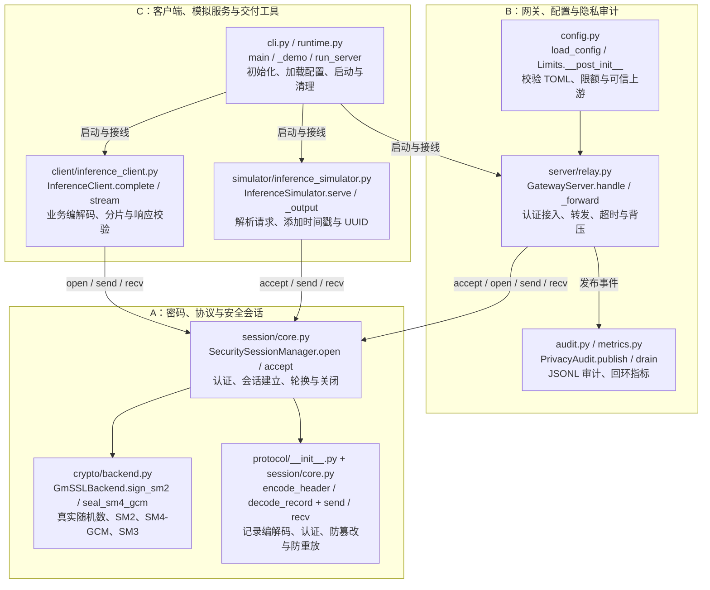
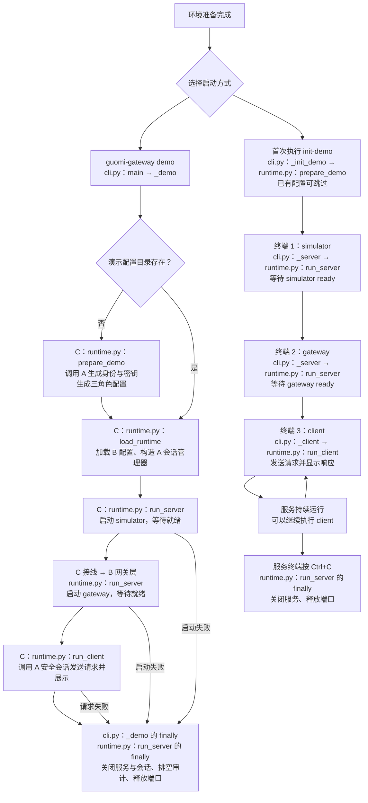
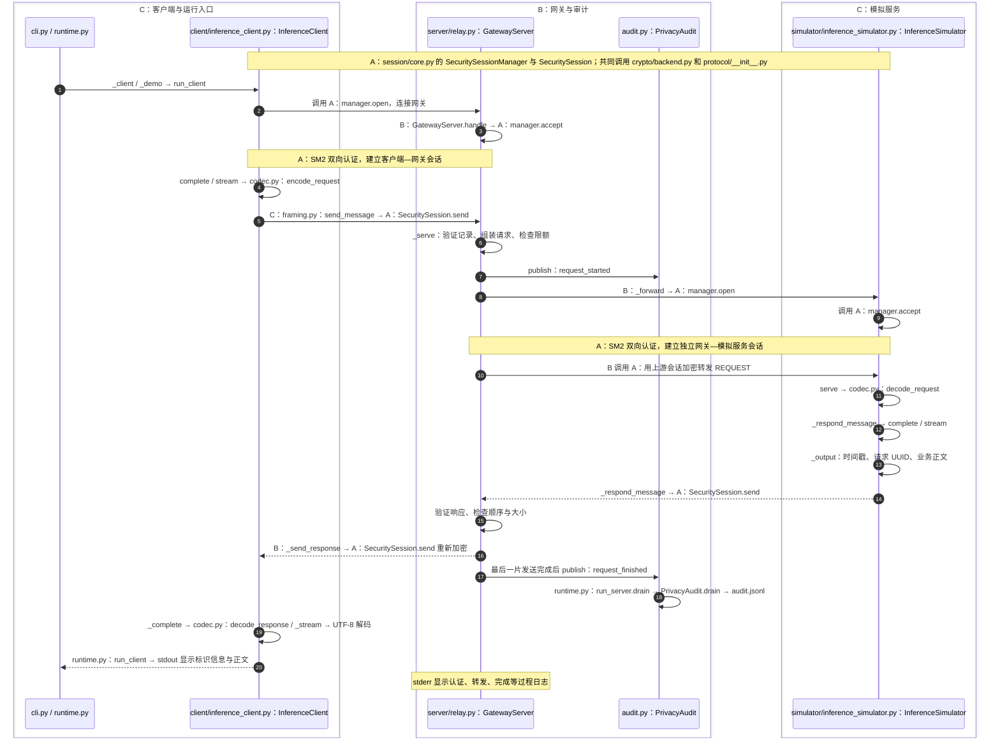

# 国密大模型推理安全网关

Python 三程序原型：客户端通过国密安全会话连接网关，网关再通过独立安全会话连接推理服务端模拟程序。设计采用 SM2 身份认证与密钥保护、SM4-GCM 报文保护以及隐私化审计。

已整合真实 GmSSL 密码后端、安全会话、网关转发、客户端、模拟服务和三个独立程序入口。支持普通与流式响应、隐私审计和回环指标；启动步骤见 [使用说明](docs/usage.md)，验证范围见 [整合报告](docs/integration_report.md)。

## 快速开始

Windows（PowerShell）：

```powershell
powershell -NoProfile -ExecutionPolicy Bypass -File scripts/bootstrap.ps1
```

Linux x86_64（Bash）：

```bash
bash scripts/bootstrap.sh
```

脚本下载并校验固定版本 uv，安装固定 Python、同步 `uv.lock`，构建固定 GmSSL 并执行静态检查和测试；首次运行需要联网及 CMake、C 编译器。Windows 默认使用 Visual Studio C 工具链，也可按 [协议文档](docs/protocol.md#原生环境) 指定 GCC 与 Ninja。工具及环境保存在当前 checkout 的忽略目录，不需要系统 Python。仅准备 Python 环境时使用 PowerShell 的 `-SkipChecks` 或 Bash 的 `--skip-checks`。

环境就绪后，在仓库根目录运行一次安全推理演示：

```powershell
.\.venv\Scripts\guomi-gateway.exe demo --prompt "你好"
```

Linux 使用 `.venv/bin/guomi-gateway demo --prompt "你好"`，先按 [原生环境](docs/protocol.md#原生环境) 设置 `LD_LIBRARY_PATH`。`demo` 自动初始化本地身份和配置、启动模拟器与网关、发送请求并在结束后关闭服务；重复运行复用配置。加 `--stream` 可查看流式输出，省略提示词默认发送“你好”。分开启动各程序见 [使用说明](docs/usage.md)。

模拟响应先显示 UTC 时间戳和请求 UUID，再显示业务正文。终端默认显示服务启动、认证、转发与完成过程；使用 `guomi-gateway --quiet demo` 可隐藏过程日志。16 KiB 手动测试与响应校验见 [使用说明](docs/usage.md#16-kib-手动测试)。

## A/B/C 职责分工

A、B、C 是开发分工。C 提供客户端与模拟服务的业务层和启动接线，B 提供网关与审计，A 的密码与安全会话能力由三个程序共同调用。模块归属见 [实施分工](docs/implementation_plan.md#132-三条并行线路)。



## 启动流程

`demo` 自动管理服务生命周期；手动三程序启动后，可以重复执行 `client`。下面的命令均使用上文的平台入口。



手动服务已经运行时，使用 `client`。`demo` 会另外启动服务，使用相同端口会发生冲突。完整参数和停机方式见 [使用说明](docs/usage.md)。

## 请求调用链（Call chain）

客户端与网关、网关与模拟服务分别建立独立安全会话；网关验证收到的记录后，用另一段会话重新加密转发。



流式响应按分片重复返回路径，直到最后一片；审计结束事件记录结果、耗时和字节数。`simulate` 是本地调用：`main → _simulate → InferenceSimulator.complete/stream → _output → stdout`，不会经过网关。

### 源码位置索引

图内文件路径均相对于 `src/gateway/`；以下链接指向实际源码。方法写为 `类名.方法名`，`run_server.handle` 和 `run_server.drain` 是 `run_server` 内的嵌套函数。

| 分工 | 做什么 | 文件 | 函数或方法 |
| --- | --- | --- | --- |
| C | 命令解析、演示编排、手动入口、本地模拟、日志输出配置 | [cli.py](src/gateway/cli.py) | `main`、`build_parser`、`_demo`、`_init_demo`、`_server`、`_client`、`_simulate` |
| C | 生成身份和配置、装配运行环境 | [runtime.py](src/gateway/runtime.py) | `prepare_demo`、`load_backend`、`load_runtime` |
| C | 启动监听、分派连接、审计落盘、停机清理和运行日志 | [runtime.py](src/gateway/runtime.py) | `run_server`、`run_server.handle`、`run_server.drain` |
| C | 连接网关、调用业务客户端、向 stdout 输出响应 | [runtime.py](src/gateway/runtime.py) | `run_client` |
| C | 普通和流式请求、响应校验、流式 UTF-8 解码 | [client/inference_client.py](src/gateway/client/inference_client.py) | `InferenceClient.complete`、`_complete`、`stream`、`_stream` |
| C | 业务请求与响应编解码 | [codec.py](src/gateway/codec.py) | `encode_request`、`decode_request`、`encode_response`、`decode_response` |
| C | 业务分片、组装与记录边界检查 | [framing.py](src/gateway/framing.py) | `send_message`、`recv_message`、`recv_business_record`、`split_payload` |
| C | 接收请求、生成普通或流式响应、添加时间戳与 UUID | [simulator/inference_simulator.py](src/gateway/simulator/inference_simulator.py) | `InferenceSimulator.serve`、`_respond_message`、`complete`、`stream`、`_stream`、`_output` |
| B | 加载配置、校验限额与上游配置 | [config.py](src/gateway/config.py) | `load_config`、`Limits.__post_init__`、`GatewayConfig.__post_init__` |
| B | 接入安全会话、组装请求、转发和响应回传 | [server/relay.py](src/gateway/server/relay.py) | `GatewayServer.handle`、`_serve`、`_forward`、`_send_response`、`close` |
| B | 发布审计事件和打印转发过程日志 | [server/relay.py](src/gateway/server/relay.py) | `GatewayServer._publish`、`handle`、`_forward` |
| B | 白名单审计事件入队和 JSONL 序列化输出 | [audit.py](src/gateway/audit.py) | `PrivacyAudit.publish`、`drain` |
| B | 指标计数、输出与回环监听 | [metrics.py](src/gateway/metrics.py) | `Metrics.increment`、`render`、`start_metrics_server` |
| A | 建立、接受、轮换和关闭会话 | [session/core.py](src/gateway/session/core.py) | `SecuritySessionManager.open`、`accept`、`rotate`、`close` |
| A | 双向认证、密钥确认、记录加解密、序列和重放检查 | [session/core.py](src/gateway/session/core.py) | `SecuritySession.handshake`、`_initiate`、`_accept`、`send`、`_send`、`recv`、`_receive` |
| A | 密码后端、身份密钥、签名、加密与摘要 | [crypto/backend.py](src/gateway/crypto/backend.py) | `GmSSLBackend.generate_keypair`、`sign_sm2`、`verify_sm2`、`encrypt_sm2`、`decrypt_sm2`、`seal_sm4_gcm`、`open_sm4_gcm`、`sm3` |
| A | 安全记录头部编解码、网络帧读写 | [protocol/__init__.py](src/gateway/protocol/__init__.py) | `encode_header`、`decode_record`、`read_frame`、`write_frame` |

C 的环境、集成测试与性能工具入口另见 [开发指南](docs/developer_guide.md) 和 [性能说明](docs/performance.md)。

## 文档与协作

- [开发指南](docs/developer_guide.md)：一键环境、三线职责、分支、接口使用及最终 merge。
- [公共接口](docs/interfaces.md)：数据结构、调用边界和扩展约定。
- [安全协议与 A 线交付](docs/protocol.md)：线格式、原生库重建、会话使用和实测范围。
- [实现方案与开发计划](docs/implementation_plan.md)：安全设计、三线计划及验收条件。
- [使用说明](docs/usage.md)：三程序启动、停机与业务层编程接口。
- [配置说明](docs/configuration.md)：身份、公钥信任、资源限额、审计与指标。
- [本地部署与回滚](docs/deployment.md)：演示环境生命周期与恢复步骤。
- [整合报告](docs/integration_report.md)：来源提交、回归结果与剩余验收项。
- [性能与 TLS 对照](docs/performance.md)：三进程实验、统计口径、复现命令与实测结果。
- [Agent 入口](AGENT.md)：按任务定位编码、测试、依赖及 CI/CD 规范。

源码在 `src/`，测试在 `test/`，设计与规范在 `docs/`。GmSSL 固定为 3.1.1、官方绑定为 `gmssl-python==2.2.2`；初始化在 checkout 内构建库并验证。Windows 已完成真实三程序测试；Linux、性能/TLS 对照和生产部署的验收状态见整合报告。
