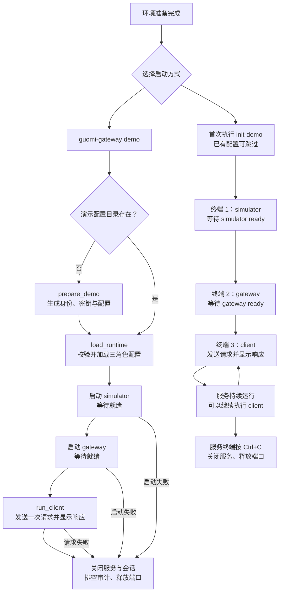
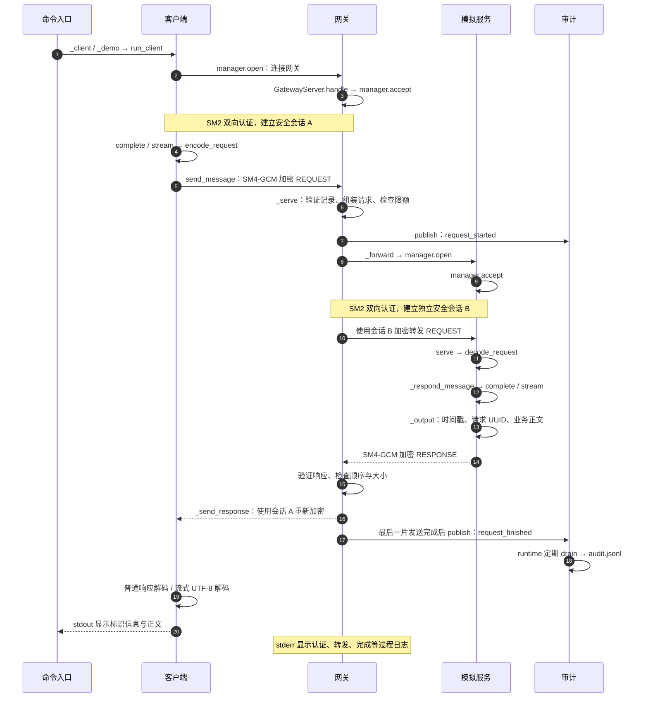

# 国密大模型推理安全网关

Python 三程序原型：客户端通过国密安全会话连接网关，网关再通过独立安全会话连接推理服务端模拟程序。设计采用 SM2 身份认证与密钥保护、SM4-GCM 报文保护以及隐私化审计。

已整合真实 GmSSL 密码后端、安全会话、网关转发、客户端、模拟服务和三个独立程序入口。支持普通与流式响应、隐私审计和回环指标；启动步骤见 [使用说明](docs/usage.md)，验证范围见 [整合报告](docs/integration_report.md)。

## 快速开始

Windows（PowerShell）：

```powershell
powershell -NoProfile -ExecutionPolicy Bypass -File scripts/bootstrap.ps1
```

Linux x86_64（Bash）：

```bash
bash scripts/bootstrap.sh
```

脚本下载并校验固定版本 uv，安装固定 Python、同步 `uv.lock`，构建固定 GmSSL 并执行静态检查和测试；首次运行需要联网及 CMake、C 编译器。Windows 默认使用 Visual Studio C 工具链，也可按 [协议文档](docs/protocol.md#原生环境) 指定 GCC 与 Ninja。工具及环境保存在当前 checkout 的忽略目录，不需要系统 Python。仅准备 Python 环境时使用 PowerShell 的 `-SkipChecks` 或 Bash 的 `--skip-checks`。

环境就绪后，在仓库根目录运行一次安全推理演示：

```powershell
.\.venv\Scripts\guomi-gateway.exe demo --prompt "你好"
```

Linux 使用 `.venv/bin/guomi-gateway demo --prompt "你好"`，先按 [原生环境](docs/protocol.md#原生环境) 设置 `LD_LIBRARY_PATH`。`demo` 自动初始化本地身份和配置、启动模拟器与网关、发送请求并在结束后关闭服务；重复运行复用配置。加 `--stream` 可查看流式输出，省略提示词默认发送“你好”。分开启动各程序见 [使用说明](docs/usage.md)。

模拟响应先显示 UTC 时间戳和请求 UUID，再显示业务正文。终端默认显示服务启动、认证、转发与完成过程；使用 `guomi-gateway --quiet demo` 可隐藏过程日志。16 KiB 手动测试与响应校验见 [使用说明](docs/usage.md#16-kib-手动测试)。

## 启动流程

`demo` 自动管理服务生命周期；手动三程序启动后，可以重复执行 `client`。下面的命令均使用上文的平台入口。



手动服务已经运行时，使用 `client`。`demo` 会另外启动服务，使用相同端口会发生冲突。完整参数和停机方式见 [使用说明](docs/usage.md)。

## 请求调用链（Call chain）

客户端与网关、网关与模拟服务分别建立独立安全会话；网关验证收到的记录后，用另一段会话重新加密转发。



流式响应按分片重复返回路径，直到最后一片；审计结束事件记录结果、耗时和字节数。`simulate` 是本地调用：`main → _simulate → InferenceSimulator.complete/stream → _output → stdout`，不会经过网关。

## 文档与协作

- [开发指南](docs/developer_guide.md)：一键环境、三线职责、分支、接口使用及最终 merge。
- [公共接口](docs/interfaces.md)：数据结构、调用边界和扩展约定。
- [安全协议与 A 线交付](docs/protocol.md)：线格式、原生库重建、会话使用和实测范围。
- [实现方案与开发计划](docs/implementation_plan.md)：安全设计、三线计划及验收条件。
- [使用说明](docs/usage.md)：三程序启动、停机与业务层编程接口。
- [配置说明](docs/configuration.md)：身份、公钥信任、资源限额、审计与指标。
- [本地部署与回滚](docs/deployment.md)：演示环境生命周期与恢复步骤。
- [整合报告](docs/integration_report.md)：来源提交、回归结果与剩余验收项。
- [性能与 TLS 对照](docs/performance.md)：三进程实验、统计口径、复现命令与实测结果。
- [Agent 入口](AGENT.md)：按任务定位编码、测试、依赖及 CI/CD 规范。

源码在 `src/`，测试在 `test/`，设计与规范在 `docs/`。GmSSL 固定为 3.1.1、官方绑定为 `gmssl-python==2.2.2`；初始化在 checkout 内构建库并验证。Windows 已完成真实三程序测试；Linux、性能/TLS 对照和生产部署的验收状态见整合报告。
