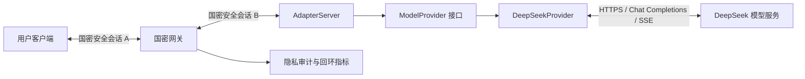
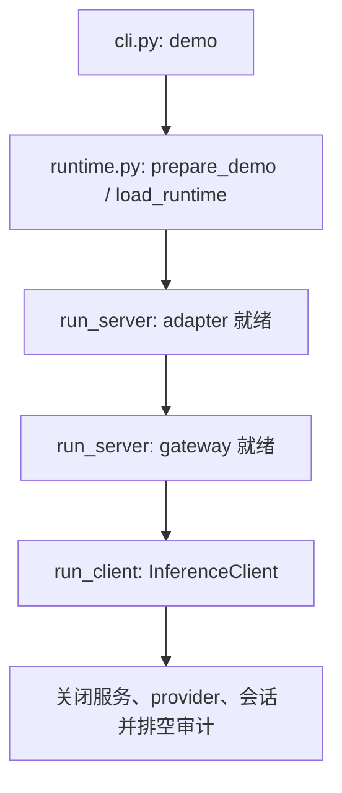
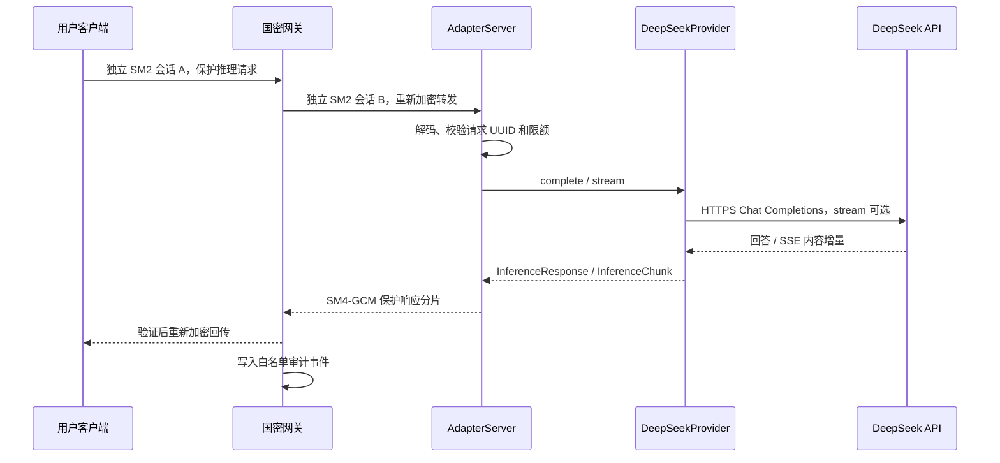

# 国密大模型推理安全网关

用户客户端通过国密网关连接模型适配器 adapter，由 adapter 调用 DeepSeek 真实模型服务。客户端至网关、网关至 adapter 使用独立的 SM2 认证和 SM4-GCM 安全会话；adapter 至模型服务使用 HTTPS。


```mermaid
flowchart LR
    U[用户客户端] <-->|国密安全会话 A| G[国密网关]
    G <-->|国密安全会话 B| A[AdapterServer]
    A --> P[ModelProvider 接口]
    P --> D[DeepSeekProvider]
    D <-->|HTTPS / Chat Completions / SSE| M[DeepSeek 模型服务]
    G --> L[隐私审计与回环指标]
```

adapter 负责已认证请求的业务编解码、模型接口转换、响应分片和取消清理；网关负责身份认证、安全转发、资源限额与审计。供应商专用逻辑由 provider 实现。本次提供 DeepSeek，后续供应商通过实现 `ModelProvider` 并注册工厂接入。

## 快速开始

Windows（PowerShell）：

```powershell
powershell -NoProfile -ExecutionPolicy Bypass -File scripts/bootstrap.ps1
$env:DEEPSEEK_API_KEY = '<你的 DeepSeek API Key>'
.\.venv\Scripts\guomi-gateway.exe demo --prompt "你好"
.\.venv\Scripts\guomi-gateway.exe demo --prompt "你好" --stream
```

Linux（Bash）：

```bash
bash scripts/bootstrap.sh
export DEEPSEEK_API_KEY='<你的 DeepSeek API Key>'
.venv/bin/guomi-gateway demo --prompt '你好'
```

Linux 启动前设置 [原生库加载路径](docs/protocol.md#原生环境)。初始化脚本安装固定 Python、uv 和锁定依赖，构建并校验 GmSSL；首次运行需要联网、CMake 和 C 编译器。

默认模型为 `deepseek-flash`，关闭思考模式。`--model` 可指定模型，`--max-output-tokens` 为真实输出 token 上限，默认 512。响应以 UTC 时间戳和请求 UUID 的 JSON 行开头，随后为模型回答。`--quiet` 放在子命令前可隐藏过程日志。

也可在命令执行目录创建 `.env`，填写 `DEEPSEEK_API_KEY` 和可选的 `DEEPSEEK_BASE_URL`，格式见 [环境与凭据](docs/usage.md#环境与凭据)。adapter、demo、infer、init-demo 和 webui 自动加载该文件，已有进程环境变量优先；已有 adapter 配置使用 JSON 中的 `base_url`，WebUI 可保存端点覆盖。

`demo` 首次生成本地身份和配置，启动 adapter 与网关，发送请求后关闭服务；再次运行复用配置。已有旧配置先按 [迁移说明](docs/deployment.md#从模拟服务迁移) 更新。

## 独立程序与直接推理

Windows 双击根目录 `start.cmd`，自动初始化本地身份、启动三角色 WebUI 及 adapter／网关业务服务，并打开三个浏览器页面。先完成 bootstrap，并在根目录 `.env` 配置模型凭据。在启动窗口按 Ctrl+C 统一停止本次启动的服务。端口设置与命令用法见 [一键启动](docs/webui.md#一键启动)。

三个角色各有本地中文 WebUI。先初始化身份，再在各角色的终端运行：

```powershell
.\.venv\Scripts\guomi-gateway.exe webui --role client
.\.venv\Scripts\guomi-gateway.exe webui --role gateway
.\.venv\Scripts\guomi-gateway.exe webui --role adapter
```

本机浏览器分别打开 `http://127.0.0.1:18080`、`:18081`、`:18082`。页面加载现有身份、保存连接地址，启动 adapter 与网关后，在客户端执行普通或流式推理。UI 启动不自动启动业务服务。局域网实验在每台角色主机本地打开 UI，角色之间继续使用国密协议；浏览器回环段使用 HTTP。详细步骤见 [WebUI 使用说明](docs/webui.md)。

```powershell
.\.venv\Scripts\guomi-gateway.exe init-demo
# 终端 1，设置 DEEPSEEK_API_KEY 后启动
.\.venv\Scripts\guomi-gateway.exe adapter
# 终端 2
.\.venv\Scripts\guomi-gateway.exe gateway
# 终端 3
.\.venv\Scripts\guomi-gateway.exe client --prompt "你好" --stream
```

`infer --prompt "你好"` 直接调用 provider。三程序启动及停止、检索片段和文件输入见 [使用说明](docs/usage.md)。


```mermaid
flowchart TD
    CLI[cli.py: demo] --> INIT[runtime.py: prepare_demo / load_runtime]
    INIT --> A[run_server: adapter 就绪]
    A --> G[run_server: gateway 就绪]
    G --> C[run_client: InferenceClient]
    C --> CLEAN[关闭服务、provider、会话并排空审计]
```


```mermaid
sequenceDiagram
    participant C as 用户客户端
    participant G as 国密网关
    participant A as AdapterServer
    participant P as DeepSeekProvider
    participant M as DeepSeek API
    C->>G: 独立 SM2 会话 A，保护推理请求
    G->>A: 独立 SM2 会话 B，重新加密转发
    A->>A: 解码、校验请求 UUID 和限额
    A->>P: complete / stream
    P->>M: HTTPS Chat Completions，stream 可选
    M-->>P: 回答 / SSE 内容增量
    P-->>A: InferenceResponse / InferenceChunk
    A-->>G: SM4-GCM 保护响应分片
    G-->>C: 验证后重新加密回传
    G->>G: 写入白名单审计事件
```

## 文档与源码

2026-10-14 已完成真实 DeepSeek 三进程普通与流式请求复测，核对响应 UUID、成功审计及停机端口释放。首次请求曾失败，根因未确认；此次验证不代表稳定性、长负载或生产验收通过，详情见 [真实三进程验证](docs/integration_report.md#deepseek-真实三进程验证)。

- [实现方案](docs/implementation_plan.md)：架构、安全边界、开发职责与验收。
- [公共接口](docs/interfaces.md)：契约 2.0、adapter 和 provider 扩展接口。
- [配置说明](docs/configuration.md)：信任、资源限额和模型连接配置。
- [使用说明](docs/usage.md)：演示、独立运行及编程接口。
- [三角色 WebUI](docs/webui.md)：页面操作、局域网部署、安全边界与本地控制接口。
- [部署与迁移](docs/deployment.md)：旧角色配置迁移、凭据和回滚。
- [安全协议](docs/protocol.md)：国密记录与原生环境。
- [开发指南](docs/developer_guide.md)、[依赖管理](docs/dependencies.md)、[测试规范](docs/testing.md)。
- [整合报告](docs/integration_report.md)与[性能说明](docs/performance.md)：历史证据和当前验证边界。
- [Agent 入口](AGENT.md)：工程规范。

源码位于 `src/gateway/`：`client/` 为用户业务客户端，`server/` 为网关，`adapter/server.py` 为安全模型适配器，`adapter/provider.py` 定义供应商接口，`adapter/deepseek.py` 调用 SDK，`runtime.py` 与 `cli.py` 管理配置和生命周期。密码与安全会话位于 `crypto/`、`protocol/`、`session/`。确定性业务替身仅位于 `test/`。
